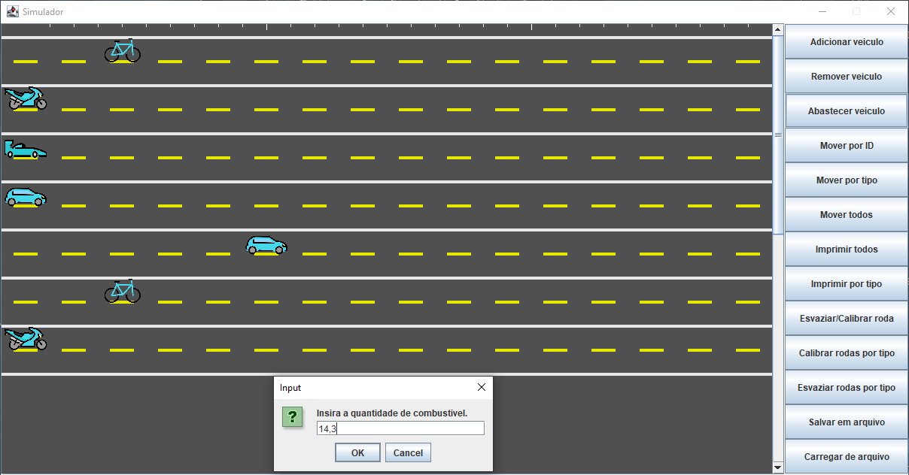

# Simulador de Corrida - Trabalho de Programação Orientada a Objetos

Este repositório contém o código fonte e a documentação do meu trabalho da disciplina de _Programação Orientada a Objetos_ da **Universidade Federal e Tecnológica do Paraná - Câmpus Pato Branco (UTFPR-PB)**.

O projeto consiste em um simulador de corrida com quatro tipos de veículos: **bicicleta, motocicleta, carro e carro de passeio**. Os veículos são implementados como classes em um _sistema hierárquico de herança_.

## Estrutura do Projeto

- **src**: Contém os arquivos de imagem dos veículos.

  - **BIKE.png**: Modelo da bicicleta.
  - **CAR.png**: Modelo do carro.
  - **MOTORCYCLE.png**: Modelo da motocicleta.
  - **SPORTCAR.png**: Modelo do carro de passeio.
  - **preview.png**: Print de tela do simulador rodando.
  - **UMLDiagram.pdf**: Diagrama de classes do projeto.

- **Vehicle.java**: A classe base `Vehicle`, que representa um veículo genérico.
- **MotorVehicle.java**: A classe `MotorVehicle`, que herda de `Vehicle` e adiciona funcionalidades específicas para veículos motorizados.
- **Bike.java**: A classe `Bike`, que herda de `Vehicle` e implementa os comportamentos exclusivos de uma bicicleta.
- **Motorcycle.java**: A classe `Motorcycle`, que herda de `MotorVehicle` e implementa os comportamentos específicos de uma motocicleta.
- **Car.java**: A classe `Car`, que herda de `MotorVehicle` e implementa os comportamentos específicos de um carro.
- **Sportcar.java**: A classe `Sportcar`, que herda de `Carro` e adiciona funcionalidades específicas para um carro de passeio.
- **IPVA.java**: A classe `IPVA`, que calcula o valor do Imposto sobre a Propriedade de Veículos Automotores (IPVA) para um veículo motorizado.

## Executando o Simulador

Para executar o simulador de corrida, siga as instruções abaixo:

1. Certifique-se de ter o Java Development Kit (JDK) instalado na sua máquina.
2. Clone este repositório em sua máquina local.
3. Navegue até o diretório através do terminal.
4. Compile os arquivos do projeto utilizando o comando `javac *.java`.
5. Execute o simulador com o comando `java Simulator`.

## Documentação

- [Diagrama de Classes](UMLDiagram.pdf): Diagrama de classes do projeto.

## Licença

Este projeto está licenciado sob a [MIT License](LICENSE).

---
